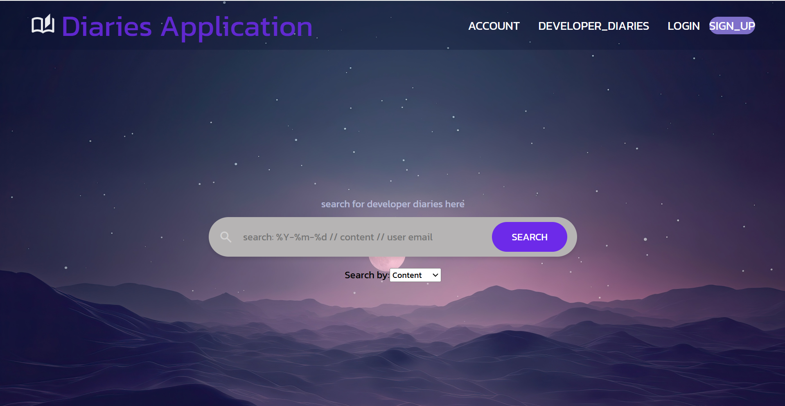
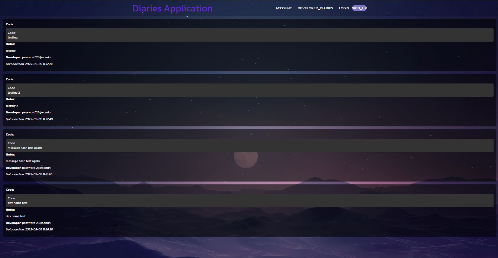
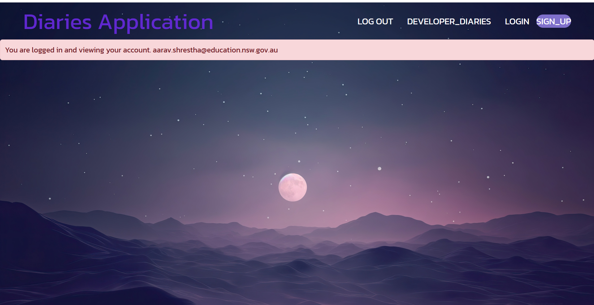

# Website-2025-Dash-johnson

first you will need to pip install these files in your bash terminal

pip install Flask Flask-SQLAlchemy bcrypt cryptography bleach

this is the home web page,

above you will find a navbar with a logo which will always redirect you to a homepage, and 4 buttons, account, developer_diaries, log in, sign up. you can sign up using an email and password but a working login is.

email: adminlogin@gmail
password: adminlogin

you will need to login in order to post for developer diaries. if you try to post one when not logged in it will come up with an error.
once you have posted a entry it will flash a message saying you have uploaded, aswell as below it will say if a new entry has been submitted although you wont be able to see it.

navigate to the home page, from here you will be able to search for content, date posted, and developer. for example if you search for.

to log out you will need to navigate to the account button on the nav bar, if you are not logged in it will redirect you to the login page and flash a message saying you are not logged in.

once on the account page press log out, you will stay logged in for 45min before your session ends.
